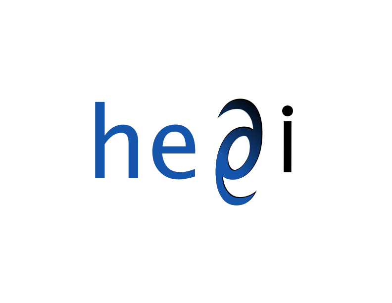

Welcome to the website for [hep-ai](https://hep-ai.org).

# Journal Club

* hep-ai is a journal club with a theoretical physics perspective on artificial intelligence.
* We meet (on the internet) on **Tuesdays every other week at 1 PM EST** via a [Zoom](https://zoom.us/).
* We have a [Slack](https://slack.com/) workspace for member discussions.
* Please email [subscribe@hep-ai.org](mailto:subscribe@hep-ai.org) if you'd like to join the mailing list or Slack.

## Schedule

### Upcoming talks

| Date | Speaker | Topic | Paper(s) | Slides |
| ----:|:------- | :---- |:-------- | :----- | 
| 10/30/2018 | Marylou Gabrié | Entropy and mutual information in models of deep neural networks  | [arxiv:1805.09785](https://arxiv.org/abs/1805.09785) |  |
| 11/13/2018 | Marat Freytsis | TBA |  |  |
| 11/27/2018 | Stefano Spigler & Mario Geiger | A jamming transition from under- to over-parametrization affects loss landscape and generalization | [arxiv:1809.09349](https://arxiv.org/abs/1809.09349) |  |
| 12/11/2018 | Yoni Kahn | TBA |  |  |
| 12/25/2018 |  | _No Talk, Winter Break_ |  |  |
| 1/8/2019 |  | Open |  |  |

### Past talks

| Date | Speaker | Topic | Paper(s) | Slides |
| ----:|:------- | :---- |:-------- | :----- |
| 10/16/2018 | Sho Yaida | Fluctuation-dissipation relations for SGD | [arxiv:1810.00004](https://arxiv.org/abs/1810.00004) | [Yes](slides/2018-10-16.pptx)|
| 10/2/2018 | Noam Brown | Beating Humans at Poker | [science.aao1733](http://science.sciencemag.org/content/early/2017/12/15/science.aao1733) | |
| 9/18/2018 | Josh Batson | Learning to Denoise Without Clean Data | [arXiv:1803.04189](https://arxiv.org/abs/1803.04189) | [Yes](slides/2018-09-18.pdf) |
| 9/4/2018 | Levent Sagun | Continuation of the Exploration of the Loss Landscape: an Empirical View | | [Yes](slides/2018-09-04.pdf) |
| 8/21/2018 | Boris Hanin  | Everything You Wanted to Know About the Loss Surface but Were Afraid to Ask – The Talk | Many | [Yes](slides/2018-08-21.pdf) |
| 8/7/2018 | Yasaman Bahri | Deep Learning and Quantum Entanglement | [arXiv:1704.01552](https://arxiv.org/abs/1704.01552) | [Yes](slides/2018-08-07.pdf) |
| 7/24/2018 | Adam Brown | Fun in High-Dimensional Spaces |  | |
| 7/10/2018 | | _Cancelled due to ICML_ | | |
| 6/26/2018 | David Schwab | Renormalizing Data | [Koch-Janusz & Ringel](https://www.nature.com/articles/s41567-018-0081-4) and past work and a future idea | Not Yet|
| 6/19/2018 | Everyone | Generative Query Networks -- Discussion | [Eslami, et al.](http://science.sciencemag.org/content/360/6394/1204) | No |
| 6/12/2018 | Ethan Dyer | InfoGAN - Disentangled Latent Representations | [arXiv:1606.03657](https://arxiv.org/abs/1606.03657) |[Yes](slides/2018-06-12.key) |
| 5/29/2018 | Dima Krotov | Dense Associative Memory & Adversarial Inputs | [NIPS 2016](http://papers.nips.cc/paper/6121-dense-associative-memory-for-pattern-recognition.pdf), [arxiv:1701.00939](https://arxiv.org/abs/1701.00939) | [Yes](slides/2018-05-29.pdf) |
| 5/15/2018 | Eric Mintun | Attention | e.g. [arxiv:1409.0473](https://arxiv.org/abs/1409.0473), [arxiv:1702.00887](https://arxiv.org/abs/1702.00887), [arxiv:1706.03762](https://arxiv.org/abs/1706.03762) |[Yes](slides/2018-05-15.pdf) |
| 5/1/2018 | Adam Brown | A Critical Review of Quantum Machine Learning | [nature23474](https://www.nature.com/articles/nature23474), [arxiv:1611.09347](https://arxiv.org/abs/1611.09347) | [Yes](slides/2018-05-01.pdf) |
| 4/17/2018 | Josh Batson | Equivariance in Deep Learning | [arxiv:1703.06114](https://arxiv.org/abs/1703.06114), [arxiv:1801.10130](https://arxiv.org/abs/1801.10130) | [Yes](slides/2018-04-17.pdf) |
| 4/3/2018 | Shay Moran | Generalization and Simplification in Statistical Learning | | [Yes](slides/2018-04-03.pdf) |
| 3/20/2018 | Yoni Kahn | Training Pruned Neural Networks | [arxiv:1803.03635](https://arxiv.org/abs/1803.03635) | No |
| 3/6/2018 | Paul Christiano | AI Safety, Human Feedback, Robustness + Transparency | [arxiv:1706.03741](https://arxiv.org/abs/1706.03741) + others | [Yes](slides/2018-03-06.key)|
| 2/20/2018 | Jamie Sully | Adversarial Examples | [arxiv:1801.02774](https://arxiv.org/abs/1801.02774) | [Yes](slides/2018-02-20.pptx) |
| 2/6/2018 | Boris Hanin | When do exploding and vanishing gradients happen? | [arxiv:1801.03744](https://arxiv.org/abs/1801.03744) | [Yes](slides/2018-02-06.pdf) |
| 1/23/2018 | Guy Gur-Ari | Three Factors Influencing Minima in SGD| [arxiv:1711.04623](https://arxiv.org/abs/1711.04623) | [Yes](slides/2018-01-23.pdf) |
| 1/9/2018 | Max Kleiman-Weiner | Hierarchical RL and Eigenoptions | [arxiv:1703.00956](https://arxiv.org/abs/1703.00956), [arxiv:1710.11089](https://arxiv.org/abs/1710.11089) | [Yes](slides/2018-01-09.key) |
| 12/26/2017 | Yoni Kahn | Spontaneous Symmetry Breaking and Informtion Bottlenecks | [arxiv:1710.06096](https://arxiv.org/abs/1710.06096) | [Yes](slides/2017-12-26.pdf) |
| 12/12/2017 | Eric Mintun | Capsule Networks | [Hinton, Krizhevsky, Wang](http://www.cs.toronto.edu/~fritz/absps/transauto6.pdf), [arxiv:1710.09829](https://arxiv.org/abs/1710.09829) | [Yes](slides/2017-12-12.pdf) |
| 11/21/2017 | Jared Kaplan | Varitional Information Maximizing Exploration and Curiosity-Driven Self-Supervision | [arxiv:1605.09674](https://arxiv.org/abs/1605.09674), [arxiv:1705.05363](https://arxiv.org/abs/1705.05363) | [Yes](slides/2017-11-21.key) |
| 11/7/2017 | DJ Strouse | Information Bottlenecks and Variational Inference | [arxiv:1612.00410](https://arxiv.org/abs/1612.00410) | No |
| 10/24/2017 | Jamie Sully | AlphaGo Zero | [nature24270](https://www.nature.com/articles/nature24270) | [Yes](slides/2017-10-24.pptx) |
| 10/10/2017 | Dan Roberts | Intro to RL and Distributional RL | [arxiv:1707.06887](https://arxiv.org/abs/1707.06887) | [Yes](slides/2017-10-10.pdf) |
| 9/26/2017 | Ethan Dyer | Learning to RL & RL2 | [arxiv:1611.02779](https://arxiv.org/abs/1611.02779), [arxiv:1611.05763](https://arxiv.org/abs/1611.05763) | [Yes](slides/2017-09-26.pdf) |
| 9/12/2017 | Guy Gur-Ari | Learning to Learn and Metalearning | [arxiv:1606.04474](https://arxiv.org/abs/1606.04474), [arxiv:1703.03400](https://arxiv.org/abs/1703.03400) | [Yes](slides/2017-09-12.pdf) |
| 8/29/2017 | Jaehoon Lee | KFAC | [arxiv:1503.05671](https://arxiv.org/abs/1503.05671) | No |

***

 
.logo{
    border:0;
    padding: 0;
     width="150";
 }
